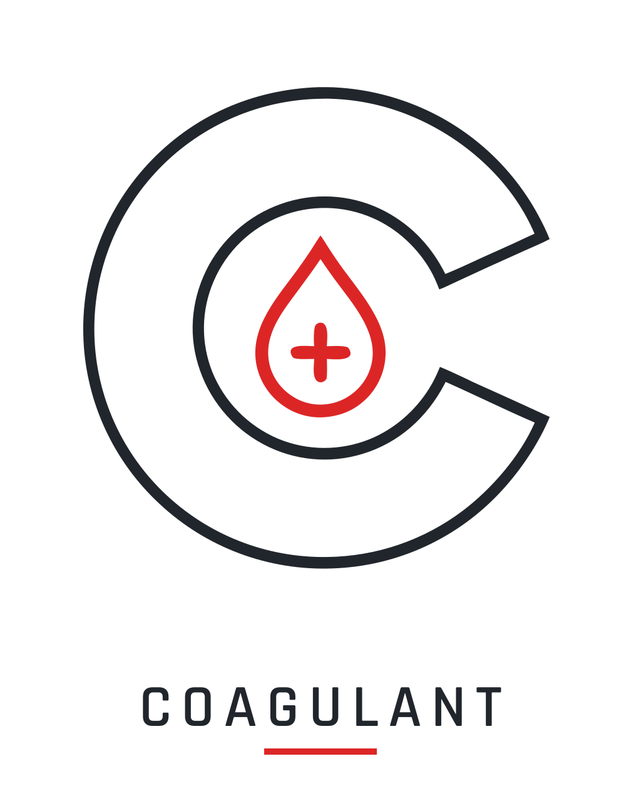

  <picture>
    <source media="(prefers-color-scheme: dark)" srcset="assets/coagulant_lockup_dark.svg">
    
  </picture>

# Coagulant

Player **medical** module of the [Corpus](https://github.com/Sepuldosky/corpus) ecosystem
for **Garry's Mod**, ACE3-style: zone-based wounds, bleeding, vitals, and treatment. Independent
addon that **hard-depends** on Corpus (the ecosystem's only hard dependency) and detects the
other modules at runtime, never assumes them.

> **Status: Block 3 CLOSED — all 4 slices verified in-game.** The medical domain design is
> ratified (2026-07-13) in [`docs/Coagulant_Architecture.md`](docs/Coagulant_Architecture.md)
> and implemented in code: blood volume (0-100) running parallel to native HP, zone-based
> wounds typed by damage type with severity from the final damage, bleeding that drains blood
> and — below the critical threshold — HP, three zonal debuffs (limping, aim sway, vision),
> treatment with application time and interruption, five medical items against the
> [Cargo](https://github.com/Sepuldosky/corpus-cargo) item framework (bandage, tourniquet,
> medkit, blood bag, painkillers) and the UI (zonal silhouette, medical menu, Q tab). The
> **4 slices are verified in-game** (rounds 1-7, 2026-07-20) and the block closed; the
> `torso` → `chest`/`stomach` zone split landed in code and was verified in-game on
> 2026-07-21 (round O — 7 clinical zones). Pain (COA-52) — a per-zone derived stat plus a
> saturated global perceived value, with painkillers as the 5th medical item — landed in
> code and **closed in-game on 2026-08-25** (12/12 checks, no defects); it travels only in
> the state snapshot, never over NW2. Caliber integration stays mock-first until its player
> pipeline exists. Today's snapshot → [`docs/coagulant_estado.md`](docs/coagulant_estado.md);
> the ecosystem roadmap lives in the
> [Corpus roadmap](https://github.com/Sepuldosky/corpus/blob/main/docs/corpus_roadmap.txt).

## Dependencies

- **Corpus** (hard — ecosystem framework).
- **Caliber** (soft — enriched hit-location with armor/zone data). Without it, Coagulant
  degrades to raw hitgroup-based hit-location from the engine.
- **Cargo** (soft — bandages, tourniquets, and other medical items as inventory items).
  Without it, the medical menu offers the same treatments without consuming items, with a
  30 s cooldown and labeled "field" — an explicit degraded mode.

Ecosystem reference design and dependency graph →
[`CORPUS_Architecture.md`](https://github.com/Sepuldosky/corpus/blob/main/docs/CORPUS_Architecture.md)
(§1-§2, §9).
